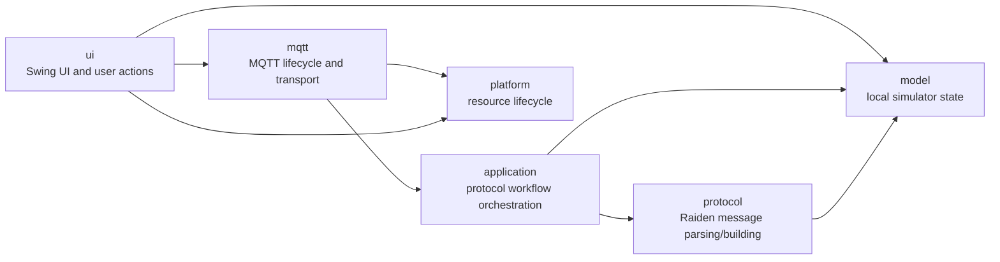

# Architecture

This project is a small Java Swing simulator for backend MQTT protocol testing. The architecture should stay close to that purpose: keep the UI simple, keep the local simulator state explicit, and keep protocol and transport details observable.

## Package Responsibilities

### `model`

Client-side local state model for the simulator.

- Owns simulated station and port state.
- Owns allowed charging port state transitions.
- Exposes immutable snapshots for UI rendering and protocol message building.
- Does not know about Swing, MQTT, JSON payloads, or threads beyond internal synchronization.

Classes:

- `ChargingStation`: simulated station state container; owns the charging port collection.
- `ChargingPort`: single-port state machine for start charging, manual stop, rollback, restore, and billing completion.
- `ChargingPortState`: port state enum: `IDLE`, `CHARGING`, `STOPPED`.
- `ChargingPortSnapshot`: immutable view of a port at one point in time.

### `application`

Application workflow orchestration.

- Converts incoming protocol messages into local model operations.
- Decides which protocol responses or reports should be published.
- Coordinates rollback when local state changed but message publishing failed.
- Reports application-level events to the UI through listener interfaces.
- Depends on `model` and `protocol`, but not on Swing or Paho MQTT.

Classes:

- `ChargingApplicationService`: handles `cdz=101`, `cdz=104`, manual stop, and periodic reports.
- `ChargingApplicationListener`: callback for application logs and port-state changes.
- `MessagePublisher`: outbound message abstraction used by the application layer.

### `protocol`

Raiden protocol parsing and message building.

- Parses incoming payloads into structured messages.
- Parses command-specific `data` fields.
- Builds outbound JSON payloads for business responses, reports, and local notifications.
- Does not change local state and does not publish messages.

Classes:

- `RaidenProtocolCodec`: parser and builder for `cdz`, `msg_id`, and `data` payloads.
- `RaidenMessage`: parsed protocol message value object.

### `mqtt`

MQTT lifecycle and transport.

- Owns Paho MQTT client setup, connect, subscribe, publish, disconnect, and forced close.
- Emits raw MQTT trace logs.
- Serializes incoming MQTT messages before handing them to the application service.
- Starts and stops periodic report scheduling with the MQTT connection.
- Owns connection lifecycle details such as connecting, cancelling, disconnecting, failed, and lost.

Classes:

- `MqttConnectionController`: connection-session coordinator. Creates service instances, owns the local message id counter, handles lifecycle state, and routes UI actions to the active service.
- `MqttService`: Paho MQTT transport implementation and `MessagePublisher`.
- `ConnectionListener`: connection-status and connection-log callback interface.
- `MqttConnectionStatus`: MQTT lifecycle event enum.

### `ui`

Swing UI and user interaction.

- Builds the main window and panels.
- Displays local model snapshots.
- Sends user actions to the connection controller.
- Keeps top-level connection badge intentionally simple: only `在线` and `离线`.
- Shows detailed lifecycle and protocol evidence in the event log.

Classes:

- `MainFrame`: UI composition root and callback bridge.
- `SessionPanel`: broker/client/port-count inputs, connect/cancel/disconnect actions, and online/offline badge.
- `PortsPanel`: charging port table view and table cell rendering.
- `PortTableModel`: adapts station snapshots to a Swing table model.
- `InspectorPanel`: selected-port details and manual stop action.
- `LogPanel`: MQTT/application event log, clear action, and log trimming.
- `ChargingPortPresentation`: UI labels for port states and balances.
- `ConnectionState`: UI connection state for button behavior; badge text remains online/offline.
- `RaidenTheme`: shared Swing colors, borders, and component styling helpers.
- `MainFrameFonts`: bundled font loading.

### `platform`

Small shared lifecycle utility.

- Provides tree-shaped disposal for the Swing frame and MQTT services.
- Keeps cleanup explicit instead of relying on silent fallback behavior.

Classes:

- `Disposable`: disposable resource interface.
- `Disposer`: parent-child disposal registry and disposal executor.

## Boundary Rules

- `model` should not import `application`, `protocol`, `mqtt`, or `ui`.
- `protocol` may read `model` snapshots to build payloads, but should not mutate model objects.
- `application` owns protocol workflow decisions and should not depend on Paho MQTT classes or Swing classes.
- `mqtt` owns transport details and should not decide charging-port business transitions directly.
- `ui` owns display text, controls, layout, and user-event binding.
- Raw MQTT payloads and lifecycle details belong in the event log; the top-level connection badge stays two-state.

## Current Intentional Concentration Points

`MqttConnectionController` is intentionally a coordination point for now. It creates `ChargingApplicationService` and `MqttService`, owns connection lifecycle state, and keeps the local message id counter across connection failure, disconnect, and reconnect.

`MqttService` intentionally owns periodic report scheduling for now because reports only run while MQTT is connected and subscribed. If report scheduling becomes configurable or more application-specific, move that responsibility closer to `application`.

`MainFrame` is intentionally the Swing composition root. It may create panels and wire callbacks, but new protocol workflow logic should go into `application`, not into `MainFrame`.
