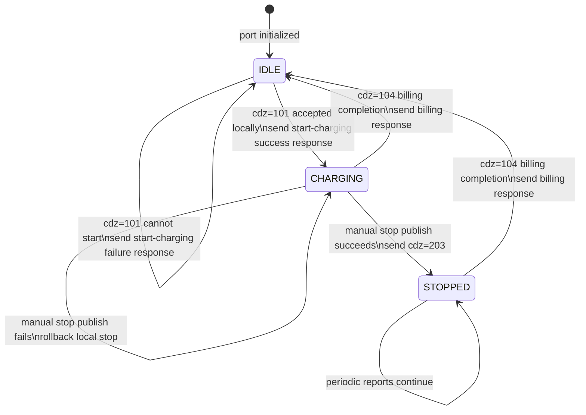
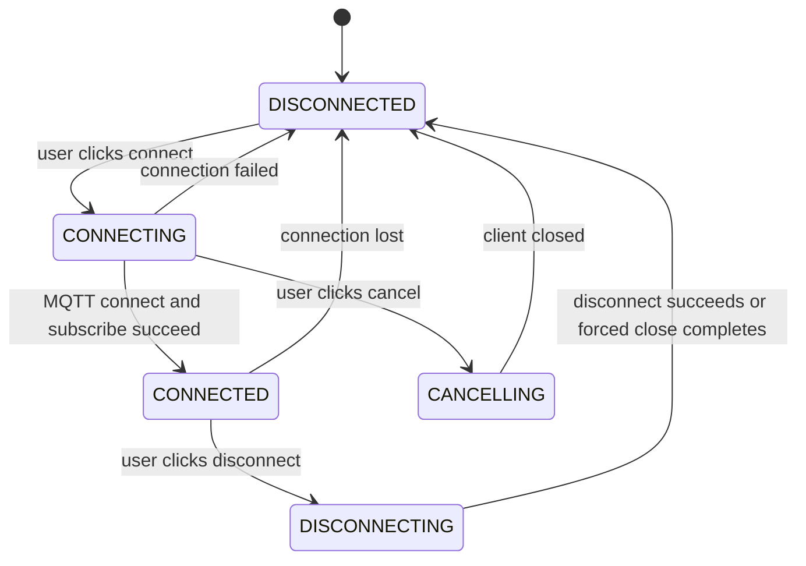
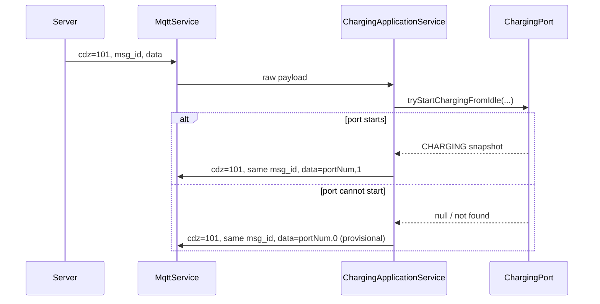
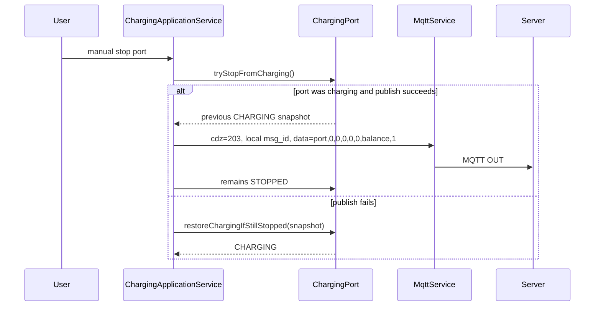
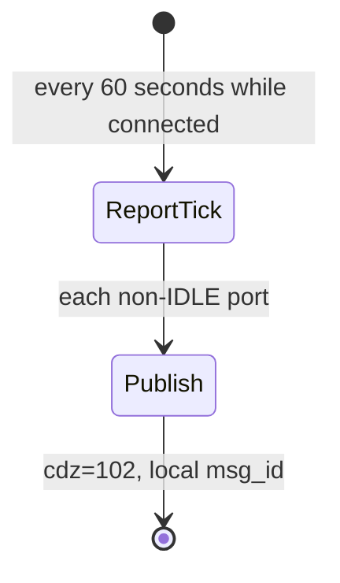

# State Machines

This document records the simulator state machines that must stay stable while the Swing UI and MQTT integration evolve. It describes current behavior and calls out protocol details that still need confirmation from the server implementation or protocol document.

## Charging Port



### States

| State | Meaning | UI label |
| --- | --- | --- |
| `IDLE` | The port has no active local charging session. | 空闲 |
| `CHARGING` | The port has accepted a server start command and is in an active local charging session. | 充电中 |
| `STOPPED` | The port was manually stopped locally and is waiting for server billing completion. | 已停充 |

There are no long-lived `STARTING` or `STOPPING` states. Start and stop are synchronous local operations in the current implementation, so process states would be too brief to help the UI and would add stuck-state handling.

### Rules

- One charging port maps to one protocol `portNum`.
- A charging port has at most one active charging session.
- Disconnecting or reconnecting MQTT does not reset charging port state.
- Changing port count while disconnected reinitializes the port set.
- Manual stop requires an active MQTT connection because it must publish `cdz=203`.
- If `cdz=203` cannot be handed to MQTT for publishing, the simulator rolls the port back from `STOPPED` to `CHARGING`.

## Connection



### Rules

- Connection configuration is locked while connecting, connected, cancelling, or disconnecting.
- Port count is only editable while disconnected.
- The top-level UI connection badge intentionally shows only `在线` or `离线`; lifecycle details such as connecting, cancelling, disconnecting, failure, and loss belong in the event log.
- Connection failure does not reset charging port state.
- Connection failure, disconnect, and reconnect keep charging port state and the local message id counter.
- Application shutdown disposes the frame root disposable, which disposes the active MQTT service tree.

## Protocol Flows

### `cdz=101` Start Charging



Rules:

- `cdz=101` response is a business response, not an MQTT QoS acknowledgement.
- The server-provided `msg_id` must be echoed exactly.
- Success response is `data=portNum,1`.
- Failure response is provisionally `data=portNum,0`; confirm this against the server protocol.
- If the success response cannot be handed to MQTT after the local port enters `CHARGING`, the simulator rolls that same local session back to `IDLE`.

### `cdz=203` Manual Stop



Rules:

- Manual stop is a simulator-side stop notification, not a request asking the server for permission.
- `STOPPED` does not release the port; the port is released by `cdz=104`.
- `cdz=203` data currently uses `port,0,0,0,0,0,balance,1`; placeholder meanings and the final `1` are not confirmed.

### `cdz=104` Billing Completion

```mermaid
sequenceDiagram
  participant Server
  participant App as ChargingApplicationService
  participant Port as ChargingPort
  participant MqttService

  Server->>App: cdz=104, msg_id, data=portNum
  alt port is CHARGING or STOPPED
    App->>Port: finishBillingIfActive()
    Port-->>App: previous active snapshot; state becomes IDLE
    App->>MqttService: cdz=104, same msg_id, billing response
  else port is IDLE
    App->>MqttService: cdz=104, same msg_id, idle response
  else port does not exist
    App-->>App: log missing not-found response format
  end
```

Rules:

- Server-side stop is represented by `cdz=104`; there is no separate supported server stop command.
- `cdz=104` releases `CHARGING` and `STOPPED` ports back to `IDLE`.
- Unknown-port response is required by the protocol but the data format is not confirmed; do not substitute an idle response.
- Current code returns the port snapshot balance in the billing response. The desired default final balance policy must be confirmed before documenting it as stable behavior.

### `cdz=102` Periodic Reports



Rules:

- Periodic reports are scheduled after MQTT connect and subscribe succeed.
- Current implementation reports every non-`IDLE` port, including `CHARGING` and `STOPPED`.
- Periodic report interval is fixed at 60 seconds for now.
- Local `msg_id` continues across connection failure, disconnect, and reconnect during one application run, but resets after application restart.

## Connection And Threading Boundaries

- Swing UI mutations must run on the Event Dispatch Thread.
- MQTT incoming messages are handed to a single message executor before entering application logic.
- Periodic reports run on a scheduled executor.
- Domain objects synchronize their own state and expose immutable snapshots to the UI.
- MQTT uses QoS 0; a successful local publish does not prove the server received or processed the message.

## Pending Protocol Confirmations

- `cdz=101` start-charging failure response data format; current provisional format is `portNum,0`.
- `cdz=104` unknown-port response data format.
- `cdz=203` data field meanings, especially placeholder zeros and the final `1`.
- `cdz=104` final balance policy: current code echoes the snapshot balance, while product discussion suggests a default final balance may later be configurable.
